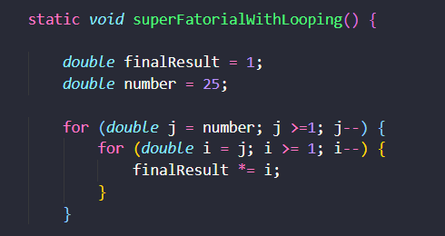

## Super fatorial

>O superfatorial de um número N é definida pelo produto dos N primeiros fatoriais de N. Assim, o superfatorial de 4 é sf(4) = 1! * 2! * 3!

-----
## Tempo de execução

| Numero utilizado | Com looping | Programação dinâmica |
| :--- | :--- | :--- |
| 4                | 2822600 ms  | 2219000 ms           |
| 10               | 2465900 ms  | 2482200 ms           |
| 25               | 2287500 ms  | 2642200 ms           |

------
## Complexidade
### Usando looping

> No exemplo a seguir se usa um loop dentro de outro loop, a complexidade para esse algoritmo é O(n^2).

### Usando programação dinâmica

> Usando função recursiva, sua complexidade é de acordo com as chamadas da função, sendo O(2n).

----
